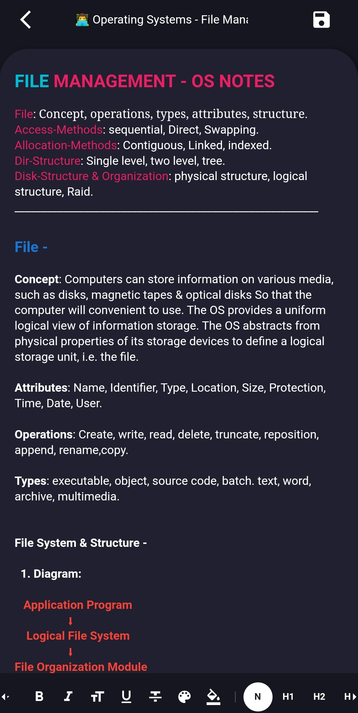

# Secure Notes - A Note Taking Application

  

Secure Notes is a general purpose note taking application. 
The application uses very minimal local storage because of it being cloud based. 
The backend of the application is defined in Javascript using it's well known runtime, Nodejs. 
The GUI is created using an advanced and efficient UI framework know as Flutter. 
For data storage, a document oriented and NoSql database, MongoDb was the perfect choice.

